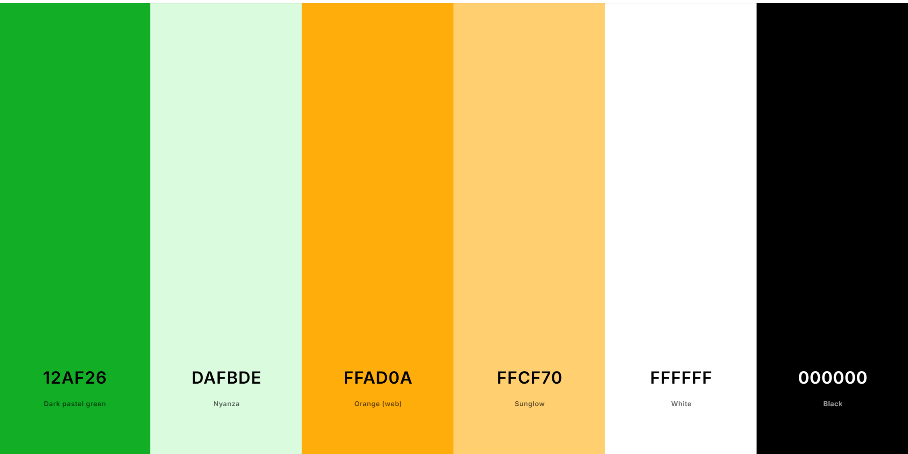
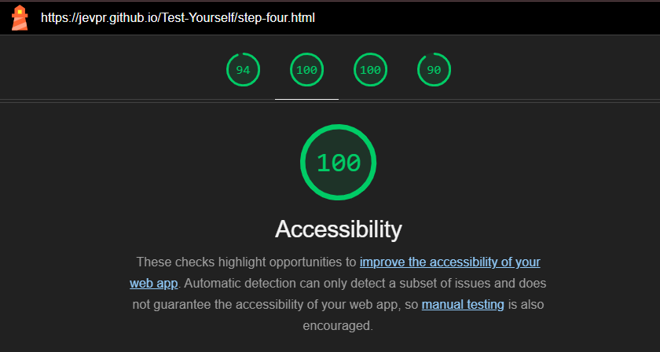
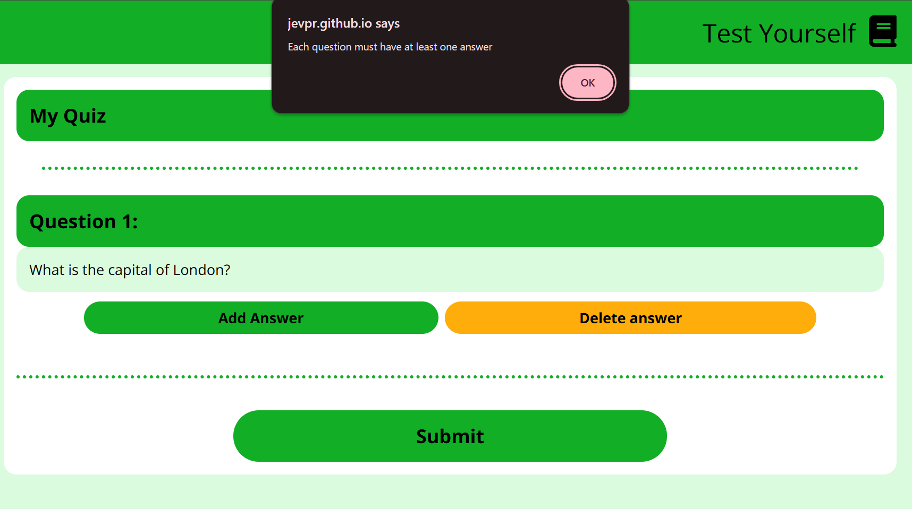

# Test Yourself

Website Url: [https://jevpr.github.io/Test-Yourself/](https://jevpr.github.io/Test-Yourself/)

Main Technologies Used: HTML, CSS, and Javascript

## Table of Contents

### 1. [Project Overview](#project-overview)

- [Purpose and Interactivity](#purpose-and-interactivity)
- [Audience](#audience)

### 2. [Design](#design)

- [Colour Palette](#colour-palette)
- [Balsamiq Wireframes](#balsamiq-wireframes)

### 3. [Features and Responsivity](#features-and-responsivity)

- [Header and Footer](#header-and-footer)
- [Landing Page](#landing-page)
- [About](#about)
- [Redirection Page](#redirection-page)
- [Quiz Builder](#quiz-builder)
- [Results Page](#results-page)
- [Updates for the next iteration](#updates-for-the-next-iteration)

### 4. [Form Validation and Media Queries](#form-validation-and-media-queries)
- [Form Validation](#form-validation)
- [Media Queries](#media-queries)

### 5. [Testing](#testing)

- [Responsive](#responsive)
- [Browser Friendly](#browser-friendly)
- [Accessible](#accessible)
- [Validator Testing](#validator-testing)
- [Unfixed Bugs, Broken Links, Commented-out Code](#unfixed-bugs-broken-links-commented-out-code)

### 6. [GitHub and Deployment](#github-and-deployment)

- [Deployment](#deployment)
- [Version Control](#version-control)

### 7. [Credits](#credits)

- [Icons and Font](#icons-and-font)
- [Attributions for Code](#attributions-for-code)

## Project Overview

### Purpose and Interactivity

Test Yourself is an easy-to-use quiz-building website. With it, users can build their own quizzes by creating questions, and assigning right and wrong answers.

Once the quiz is built, they can then present this quiz to anyone they want to test. After the quiz is taken, Test Yourself gives a mark, a percentage, and detailed feedback on each of the questions.

I wanted the site to look clean, be clear and informative, and be easy to use.

### Audience

My target audience was teachers and students. Especially, I wanted to create a tool that could be used in a classroom as part of a lesson.

- The site needed an <em>accessible style</em> that would be appropriate for all users. I took inspiration from the [BBC Bitesize website](https://www.bbc.co.uk/bitesize/topics/zx24xg8/articles/zprj7ty#zhrkjfr) layouts and [Government Website](https://www.gov.uk/).
- Layout, colours, and formatting needed to <em>foster focus and ease of use</em>.

## Design

### Colour Palette

When considering color palettes, I wanted something which was education-adjacent, but not cold - something which encouraged engagement and focus. For that reason, I started with a middle-green (#12AF26).

For an accent colour, I chose orange (#FFAD0A). I wanted to avoid the typical green-red pairing for right-wrong for two reasons:

1. Accessibility for those with red-green color blindness.
2. To avoid pairing the negative associations of 'red' with getting answers wrong. Every aspect of the quiz design was considered with positive learning in mind.

So, I chose the [following colour palette](https://coolors.co/12af26-dafbde-ffad0a-ffcf70-ffffff-000000):



The shade and brightness of each colour was chosen to ensure a range of brightness and hue. The colour palette passed accessibility checks on lighthouse:



### Balsamiq Wireframes

The following picture shows some of my initial mobile-first website design:


<br>
<br>

## Features and Responsivity

### Header and Footer

The only site-wide navigation for Test Yourself is in the logo, which when clicked will take you to the home page. This is placed on the right hand side of the header, so right-handed mobile users can easily reach it with their thumb.


For now, the site operates with linear progression - from quiz creation to result delivery. As the project grows, this will change and a navigation bar will be added.

In the footer, there is a link to my GitHub.


---

### Landing Page

The Landing page uses minimal text and a simple layout to make the purpose of the site clear.


---

### About

I included an about page so that users could access an explanation of the quiz builder. This was done to promote ease of use, and to manage expectations. For example, at the moment, 'Test Yourself' is just a multiple choice quiz. This is outlined in the about section.


---

### Redirection Page

This page will not be seen unless the user manages to load Step Two or Three without session data. Sometimes this can happen when the URL is opened in a new tab:


---

### Quiz builder

The quiz builder is generated using the initial user inputs for Step-One. It captures the title and about for your quiz, and creates the desired number of question inputs.

For each question, the user can add or remove answers. Each question must have at least one answer, and all answer / question inputs must contain text (not including spaces).

For each answer box, the user has the option to select right/wrong.


---

### Results Page

The quiz results page offers a break down of the user's scores - including a mark and a percentage.

The mark is calculated using the following method:

> number of correct answers selected / total possible correct answers.

This is a positive marking method, which is a way of evaluating student work that focuses on what students can do correctly, rather than what they get wrong.

in other words, quiz-takers are rewarded for what they get right, rather than penalised for what they get wrong.

.

The results breakdown also emphasizes positive marking. It will show you how many right answers there were for each question, and highlight the ones you selected.


---

## Updates for the next iteration

1. <b>Different Marking Styles</b>

In future updates, I would like to give the user the option to choose different marking styles, including:

- Negative Marking / Penalty Marking
- Partial Credit Marking
- Holistic Marking (for qualitative answers)
- Norm-Referenced Marking (students graded relative to their peers)
- Descriptive Feedback (written / verbal feedback on strengths and areas for improvement)
- Pass/Fail Marking
- Weighted Marking (questions carry different weights in the final score)
- Accumulate answers to give a predetermined result - like a personality test

---

2. <b> A dynamic software</b></b>

A software like this could benefit from the integration of AI and dynamic features. That might mean things like:

- Dynamic Question Selection (If a student answers a question correctly, the system presents a harder question)
- AI is available at the quiz building stage, to generate answers and save educators timeline

---

3. <b>Streamlined userface with more options</b>

This would mean the user was able to build a qider variety of quizzes, with options for:

- Qualitative answers
- Code and equational inputs (for maths and IT quizzes)
- A backend, with the ability to save quizzes and share them (for both quiz makers and quiz takers)
- An embed option, with the ability to embed a small version of a quiz into a website

---

4. I would also like to include:

- <b>A 'small / Large' text toggle</b> (to encourage accessibility, this would be placed in the top left hand corner of the header)
- <b>A 'clear data' button</b> (To save time when creating quizzes)
- <b> A personalised message for each question</b> (To allow individual feedback for each question / an explanation of the question)

## Form Validation and Media Queries

### Form Validation

User inputs are validated in a number of ways:

1. <b>Each quiz must have a title and a number of questions</b>
   
   

2. <b>The 'number of questions' field must take a number</b>
   

3. <b>Each question and answer input must contain text (after .trim has been actioned)</b>


4. <b>Each question must have at least one answer</b>



### Media Queries

The CSS for this project has been built to need minimal changes for difference screen sizes - that means, the same CSS works for most screen sizes, thanks to flexbox.

However, one media query has been used to ensure that the site works on smaller screens:

```
@media screen and (min-width: 315px) and (max-width: 360px) {
  main {
    display: block;
    overflow: scroll;
  }

  .mainDiv > p {
    text-align: center;
  }

  a.indexPage {
    font-size: medium;
    width: unset;
  }

  div.form {
    height: unset;
  }
}
```

## Testing

The project was tested by several users, to ensure all features work as intended. The site has proven easy to use, and is straightforward for those wanting to create simple quizzes.

### Responsive

The website is fully responsive for phones, tablets, laptops and desktops. In the [features section](#features-and-responsivity), you can see screenshots of all pages for difference screen sizes.

For tests, I used [Am I Responsive?](https://ui.dev/amiresponsive?url=https://jevpr.github.io/Test-Yourself/).

### Browser Friendly

The site has been tested for the following browsers: Chrome, Firefox, Safari, Edge, Vivaldi, Brave, and Tor Browser.

For tests, I used [Browserling.com](https://www.browserling.com/browse/win10/safari5.1.5/https://jevpr.github.io/Test-Yourself/).

### Accessible

I checked accessibility by running my site through the Lighthouse tool on Google Dev tools. Every page scored 100%.


### Validator Testing

HTML
No errors were returned when passing through the official [W3C Nu HTML Checker](https://validator.w3.org/nu/).

CSS
No errors were found when passing through the official validator - [W3C CSS Validator](https://jigsaw.w3.org/css-validator/). The document validates as CSS level 3 + SVG.

JavaScript
No significant issues or errors were found when passing through the ESLint validator - [ESLint](https://eslint.org/play/#eyJ0ZXh0IjoiLy9HZW5lcmFsIFZhcmlhYmxlc1xuY29uc29sZS5sb2coXCJIZWxsbyBXb3JsZCFcIik7XG5jb25zdCBxdWVzdGlvbkNvbnRhaW5lciA9IGRvY3VtZW50LmdldEVsZW1lbnRCeUlkKFwicXVlc3Rpb25Db250YWluZXJcIik7XG4vL1N0b3JlcyB0aGUgaW5wdXQgZnJvbSB0aGUgZm9ybSBhbmQgcmVkaXJlY3RzXG5mdW5jdGlvbiBzYXZlRGF0YUFuZFJlZGlyZWN0KGV2ZW50KSB7XG4gIGV2ZW50LnByZXZlbnREZWZhdWx0KCk7XG4gIGNvbnN0IHF1aXpUaXRsZSA9IGRvY3VtZW50LmdldEVsZW1lbnRCeUlkKFwicXVpelRpdGxlXCIpLnZhbHVlO1xuICBjb25zdCBhYm91dCA9IGRvY3VtZW50LmdldEVsZW1lbnRCeUlkKFwiYWJvdXRcIikudmFsdWU7XG4gIGNvbnN0IHF1ZXN0aW9uQW1vdW50ID0gZG9jdW1lbnQuZ2V0RWxlbWVudEJ5SWQoXCJxdWVzdGlvbkFtb3VudFwiKS52YWx1ZTtcbiAgd2luZG93LnNlc3Npb25TdG9yYWdlLnNldEl0ZW0oXCJxdWl6VGl0bGVcIiwgcXVpelRpdGxlKTtcbiAgd2luZG93LnNlc3Npb25TdG9yYWdlLnNldEl0ZW0oXCJhYm91dFwiLCBhYm91dCk7XG4gIHdpbmRvdy5zZXNzaW9uU3RvcmFnZS5zZXRJdGVtKFwicXVlc3Rpb25BbW91bnRcIiwgcXVlc3Rpb25BbW91bnQpO1xuICB3aW5kb3cubG9jYXRpb24uaHJlZiA9IFwic3RlcC10d28uaHRtbFwiO1xufVxuXG4vL0xvYWRzIHlvdXIgaW5wdXRzIGFuZCBpbnNlcnRzIGludG8gSFRNTFxuZnVuY3Rpb24gbG9hZERhdGEoKSB7XG4gIGNvbnN0IHVwZGF0ZWRUaXRsZSA9IGRvY3VtZW50LmdldEVsZW1lbnRCeUlkKFwidXBkYXRlZFRpdGxlXCIpO1xuICBjb25zdCB1cGRhdGVkQWJvdXQgPSBkb2N1bWVudC5nZXRFbGVtZW50QnlJZChcInVwZGF0ZWRBYm91dFwiKTtcblxuICBjb25zdCBxdWl6VGl0bGUgPSB3aW5kb3cuc2Vzc2lvblN0b3JhZ2UuZ2V0SXRlbShcInF1aXpUaXRsZVwiKTtcbiAgY29uc3QgYWJvdXQgPSB3aW5kb3cuc2Vzc2lvblN0b3JhZ2UuZ2V0SXRlbShcImFib3V0XCIpO1xuXG4gIGlmIChxdWl6VGl0bGUgJiYgYWJvdXQpIHtcbiAgICB1cGRhdGVkVGl0bGUuaW5uZXJIVE1MID0gcXVpelRpdGxlO1xuICAgIHVwZGF0ZWRBYm91dC5pbm5lckhUTUwgPSBhYm91dDtcbiAgfSBlbHNlIGlmIChxdWl6VGl0bGUgJiYgIWFib3V0KSB7XG4gICAgdXBkYXRlZFRpdGxlLmlubmVySFRNTCA9IHF1aXpUaXRsZTtcbiAgICB1cGRhdGVkQWJvdXQuc3R5bGUuZGlzcGxheSA9IFwibm9uZVwiO1xuICB9IGVsc2Uge1xuICAgIHVwZGF0ZWRUaXRsZS5pbm5lckhUTUwgPSBcIk9vcHMhIFNvbWV0aGluZyBoYXMgZ29uZSB3cm9uZy5cIjtcbiAgICB1cGRhdGVkQWJvdXQuaW5uZXJIVE1MID1cbiAgICAgICdQbGVhc2UgcmVsb2FkIHRoZSBob21lcGFnZSA8c3BhbiBjbGFzcz1cInVuZGVybGluZVwiPjxhIGhyZWY9XCJpbmRleC5odG1sXCI+aGVyZTwvYT48L3NwYW4+Lic7XG4gICAgdXBkYXRlZEFib3V0LnN0eWxlLmRpc3BsYXkgPSBcImJsb2NrXCI7XG4gICAgY29uc3QgaGlkZVN1Ym1pdCA9IGRvY3VtZW50LmdldEVsZW1lbnRCeUlkKHN1Ym1pdFR3byk7XG4gICAgaGlkZVN1Ym1pdC5zdHlsZS5kaXNwbGF5ID0gXCJub25lXCI7XG4gIH1cblxuICBjb25zb2xlLmxvZyhcIkRhdGEgbG9hZGVkXCIpO1xufVxuXG4vKlJldHJpZXZlcyB0aGUgRGF0YSBmcm9tIFNlc3Npb24gU3RvcmFnZSBhbmQgdXNlcyBpdCB0byBjcmVhdGVcbnRoZSBxdWl6IGJ1aWxkZXIqL1xuZnVuY3Rpb24gbG9hZEVtcHR5UXVlc3Rpb25zKCkge1xuICAvL3JldHJpZXZlcyBudW1iZXIgb2YgUXVlc3Rpb25zIGZyb20gc2Vzc2lvbiBzdG9yYWdlXG4gIGNvbnN0IHF1ZXN0aW9uQW1vdW50ID0gcGFyc2VJbnQoXG4gICAgd2luZG93LnNlc3Npb25TdG9yYWdlLmdldEl0ZW0oXCJxdWVzdGlvbkFtb3VudFwiKVxuICApO1xuXG4gIC8qXG5cbiAgLy8gSWYgdGhlIHF1ZXN0aW9uIGFtb3VudCBpcyBpbnZhbGlkIG9yIG5vdCBzZXQsIHdlIGV4aXQuXG4gIGlmIChpc05hTihxdWVzdGlvbkFtb3VudCkgfHwgcXVlc3Rpb25BbW91bnQgPD0gMCkge1xuICAgIGNvbnNvbGUuZXJyb3IoXCJJbnZhbGlkIHF1ZXN0aW9uIGFtb3VudFwiKTtcbiAgICByZXR1cm47IFxuICB9XG5cbiAgLy8gQ2xlYXIgYW55IGV4aXN0aW5nIGNvbnRlbnQgYmVmb3JlIGFkZGluZyBuZXcgcXVlc3Rpb25zIChvcHRpb25hbClcbiAgcXVlc3Rpb25Db250YWluZXIuaW5uZXJIVE1MID0gXCJcIjsqL1xuXG4gIC8qIEEgZm9yIGxvb3Agd2hpY2ggY3ljbGVzIHRocm91Z2ggcXVlc3Rpb25BbW91bnQsIFxuICBhbmQgY3JlYXRlcyBhIHF1ZXN0aW9uIGlucHV0IGZvciBlYWNoIG9uZSovXG4gIGZvciAobGV0IGkgPSAxOyBpIDw9IHF1ZXN0aW9uQW1vdW50OyBpKyspIHtcbiAgICBjb25zdCBxdWVzdGlvbkJveCA9IGRvY3VtZW50LmNyZWF0ZUVsZW1lbnQoXCJkaXZcIik7XG4gICAgcXVlc3Rpb25Cb3guY2xhc3NMaXN0LmFkZChcInF1ZXN0aW9uQm94XCIpO1xuICAgIHF1ZXN0aW9uQm94LmlkID0gaTtcblxuICAgIC8vIENyZWF0ZSBxdWVzdGlvbiBsYWJlbCAmIGlucHV0XG4gICAgY29uc3QgcXVlc3Rpb25MYWJlbCA9IGRvY3VtZW50LmNyZWF0ZUVsZW1lbnQoXCJsYWJlbFwiKTtcbiAgICBxdWVzdGlvbkxhYmVsLnRleHRDb250ZW50ID0gYFF1ZXN0aW9uICR7aX06YDtcbiAgICBxdWVzdGlvbkxhYmVsLmNsYXNzTGlzdC5hZGQoXCJxdWVzdGlvbkxhYmVsXCIpO1xuICAgIGNvbnN0IHF1ZXN0aW9uSW5wdXQgPSBkb2N1bWVudC5jcmVhdGVFbGVtZW50KFwiaW5wdXRcIik7XG4gICAgcXVlc3Rpb25JbnB1dC50eXBlID0gXCJ0ZXh0XCI7XG4gICAgcXVlc3Rpb25JbnB1dC5wbGFjZWhvbGRlciA9IGBFbnRlciBRdWVzdGlvbiAke2l9YDtcbiAgICBxdWVzdGlvbklucHV0LmNsYXNzTGlzdC5hZGQoXCJxdWVzdGlvbklucHV0XCIpO1xuICAgIHF1ZXN0aW9uSW5wdXQuc2V0QXR0cmlidXRlKFwicmVxdWlyZWRcIiwgXCJcIik7XG4gICAgcXVlc3Rpb25JbnB1dC5pZCA9IGBRdWVzdGlvbiR7aX1gO1xuXG4gICAgLy9jb250YWluZXIgZm9yICdhZGQgLyBkZWxldGUgYW5zd2VyJyBidXR0b25zXG4gICAgY29uc3QgYnV0dG9uQ29udGFpbmVyID0gZG9jdW1lbnQuY3JlYXRlRWxlbWVudChcImRpdlwiKTtcbiAgICBidXR0b25Db250YWluZXIuY2xhc3NMaXN0ID0gXCJidXR0b25Db250YWluZXJcIjtcblxuICAgIC8vYWRkQW5zd2VyYnV0dG9uXG4gICAgY29uc3QgYWRkQW5zd2VyID0gZG9jdW1lbnQuY3JlYXRlRWxlbWVudChcImJ1dHRvblwiKTtcbiAgICBhZGRBbnN3ZXIuaW5uZXJIVE1MID0gXCJBZGQgQW5zd2VyXCI7XG4gICAgYWRkQW5zd2VyLmNsYXNzTGlzdC5hZGQoXCJhZGRBbnN3ZXJcIik7XG5cbiAgICAvL2RlbGV0ZUFuc3dlckJ1dHRvblxuICAgIGNvbnN0IGRlbGV0ZUFuc3dlciA9IGRvY3VtZW50LmNyZWF0ZUVsZW1lbnQoXCJidXR0b25cIik7XG4gICAgZGVsZXRlQW5zd2VyLmlubmVySFRNTCA9IFwiRGVsZXRlIGFuc3dlclwiO1xuICAgIGRlbGV0ZUFuc3dlci5jbGFzc0xpc3QuYWRkKFwiZGVsZXRlQW5zd2VyXCIpO1xuXG4gICAgLy9Fc3RhYmxpc2hlcyBudW1iZXIgb2YgYW5zd2Vyc1xuICAgIGxldCBhbnN3ZXJDb3VudCA9IDA7XG5cbiAgICAvL2Z1bmN0aW9uIGZvciB0aGUgYWRkQW5zd2VyIGJ1dHRvblxuICAgIGFkZEFuc3dlci5hZGRFdmVudExpc3RlbmVyKFwiY2xpY2tcIiwgZnVuY3Rpb24gKGV2ZW50KSB7XG4gICAgICBldmVudC5wcmV2ZW50RGVmYXVsdCgpO1xuICAgICAgYW5zd2VyQ291bnQgKz0gMTtcblxuICAgICAgY29uc3QgcGFyZW50SWQgPSB0aGlzLnBhcmVudEVsZW1lbnQucGFyZW50RWxlbWVudC5pZDsgLy8gQWNjZXNzIHRoZSBwYXJlbnQncyBpZFxuICAgICAgY29uc29sZS5sb2coXCJHcmFuZHBhcmVudCBJRDpcIiwgcGFyZW50SWQpO1xuXG4gICAgICAvL0RpdiB0byBjb250YWluIGVhY2ggaW5kaXZpZHVhbCBhbnN3ZXIgYW5kIHJhZGlvc1xuICAgICAgY29uc3QgYW5zd2VyQm94ID0gZG9jdW1lbnQuY3JlYXRlRWxlbWVudChcImRpdlwiKTtcbiAgICAgIGFuc3dlckJveC5jbGFzc0xpc3QuYWRkKFwiYW5zd2VyQm94XCIpO1xuXG4gICAgICAvL0Fuc3dlciBJbnB1dFxuICAgICAgY29uc3QgYW5zd2VySW5wdXQgPSBkb2N1bWVudC5jcmVhdGVFbGVtZW50KFwiaW5wdXRcIik7XG4gICAgICBhbnN3ZXJJbnB1dC50eXBlID0gXCJ0ZXh0XCI7XG4gICAgICBhbnN3ZXJJbnB1dC5wbGFjZWhvbGRlciA9IGBFbnRlciBBbnN3ZXIgJHthbnN3ZXJDb3VudH0uLi5gO1xuICAgICAgYW5zd2VySW5wdXQuY2xhc3NMaXN0LmFkZChcImFuc3dlcklucHV0XCIpO1xuICAgICAgYW5zd2VySW5wdXQuaWQgPSBgUSR7cGFyZW50SWR9QSR7YW5zd2VyQ291bnR9YDtcbiAgICAgIGFuc3dlcklucHV0LnNldEF0dHJpYnV0ZShcInJlcXVpcmVkXCIsIFwiXCIpO1xuXG4gICAgICAvL0Fuc3dlciByYWRpbyByaWdodC13cm9uZyB0b2dnbGVzXG4gICAgICBjb25zdCByaWdodFJhZGlvID0gZG9jdW1lbnQuY3JlYXRlRWxlbWVudChcImlucHV0XCIpO1xuICAgICAgcmlnaHRSYWRpby50eXBlID0gXCJyYWRpb1wiO1xuICAgICAgcmlnaHRSYWRpby5pZCA9IGBRJHtwYXJlbnRJZH1BJHthbnN3ZXJDb3VudH1fUmlnaHRSYWRpb2A7XG4gICAgICByaWdodFJhZGlvLm5hbWUgPSBgUSR7cGFyZW50SWR9QSR7YW5zd2VyQ291bnR9X1JpZ2h0L1dyb25nYDtcbiAgICAgIHJpZ2h0UmFkaW8uY2hlY2tlZCA9IHRydWU7XG4gICAgICByaWdodFJhZGlvLmNsYXNzTGlzdC5hZGQoXCJyaWdodFJhZGlvQ2xhc3NcIik7XG5cbiAgICAgIGNvbnN0IHdyb25nUmFkaW8gPSBkb2N1bWVudC5jcmVhdGVFbGVtZW50KFwiaW5wdXRcIik7XG4gICAgICB3cm9uZ1JhZGlvLnR5cGUgPSBcInJhZGlvXCI7XG4gICAgICB3cm9uZ1JhZGlvLmlkID0gYFEke3BhcmVudElkfUEke2Fuc3dlckNvdW50fV9Xcm9uZ1JhZGlvYDtcbiAgICAgIHdyb25nUmFkaW8ubmFtZSA9IGBRJHtwYXJlbnRJZH1BJHthbnN3ZXJDb3VudH1fUmlnaHQvV3JvbmdgO1xuICAgICAgd3JvbmdSYWRpby5jbGFzc0xpc3QuYWRkKFwid3JvbmdSYWRpb0NsYXNzXCIpO1xuXG4gICAgICAvL1JpZ2h0LXdyb25nIHJhZGlvIGxhYmVsc1xuICAgICAgY29uc3QgcmlnaHRMYWJlbCA9IGRvY3VtZW50LmNyZWF0ZUVsZW1lbnQoXCJsYWJlbFwiKTtcbiAgICAgIHJpZ2h0TGFiZWwuaW5uZXJIVE1MID0gXCJSaWdodFwiO1xuICAgICAgcmlnaHRMYWJlbC5mb3IgPSBgUSR7cGFyZW50SWR9QSR7YW5zd2VyQ291bnR9X1JpZ2h0UmFkaW9gO1xuICAgICAgcmlnaHRMYWJlbC5jbGFzc0xpc3QuYWRkKFwicmlnaHRMYWJlbENsYXNzXCIpO1xuXG4gICAgICBjb25zdCB3cm9uZ0xhYmVsID0gZG9jdW1lbnQuY3JlYXRlRWxlbWVudChcImxhYmVsXCIpO1xuICAgICAgd3JvbmdMYWJlbC5pbm5lckhUTUwgPSBcIldyb25nXCI7XG4gICAgICB3cm9uZ0xhYmVsLmZvciA9IGBRJHtwYXJlbnRJZH1BJHthbnN3ZXJDb3VudH1fV3JvbmdSYWRpb2A7XG4gICAgICB3cm9uZ0xhYmVsLmNsYXNzTGlzdC5hZGQoXCJ3cm9uZ0xhYmVsQ2xhc3NcIik7XG5cbiAgICAgIGNvbnN0IHJpZ2h0V3JvbmdDb250YWluZXIgPSBkb2N1bWVudC5jcmVhdGVFbGVtZW50KFwiZGl2XCIpO1xuICAgICAgcmlnaHRXcm9uZ0NvbnRhaW5lci5jbGFzc0xpc3QuYWRkKFwicmlnaHRXcm9uZ0NvbnRhaW5lclwiKTtcblxuICAgICAgcXVlc3Rpb25Cb3guYXBwZW5kQ2hpbGQoYW5zd2VyQm94KTtcbiAgICAgIGFuc3dlckJveC5hcHBlbmRDaGlsZChhbnN3ZXJJbnB1dCk7XG4gICAgICBhbnN3ZXJCb3guYXBwZW5kQ2hpbGQocmlnaHRXcm9uZ0NvbnRhaW5lcik7XG4gICAgICByaWdodFdyb25nQ29udGFpbmVyLmFwcGVuZENoaWxkKHJpZ2h0UmFkaW8pO1xuICAgICAgcmlnaHRXcm9uZ0NvbnRhaW5lci5hcHBlbmRDaGlsZChyaWdodExhYmVsKTtcbiAgICAgIHJpZ2h0V3JvbmdDb250YWluZXIuYXBwZW5kQ2hpbGQod3JvbmdSYWRpbyk7XG4gICAgICByaWdodFdyb25nQ29udGFpbmVyLmFwcGVuZENoaWxkKHdyb25nTGFiZWwpO1xuICAgIH0pO1xuXG4gICAgZGVsZXRlQW5zd2VyLmFkZEV2ZW50TGlzdGVuZXIoXCJjbGlja1wiLCBmdW5jdGlvbiAoZXZlbnQpIHtcbiAgICAgIGV2ZW50LnByZXZlbnREZWZhdWx0KCk7XG5cbiAgICAgIGlmIChhbnN3ZXJDb3VudCA+IDApIHtcbiAgICAgICAgLy8gR2V0IGFsbCBlbGVtZW50cyB3aXRoIGNsYXNzICdhbnN3ZXJCb3gnIHdpdGhpbiBxdWVzdGlvbkJveFxuICAgICAgICBjb25zdCBhbnN3ZXJCb3hlcyA9IHF1ZXN0aW9uQm94LnF1ZXJ5U2VsZWN0b3JBbGwoXCIuYW5zd2VyQm94XCIpO1xuXG4gICAgICAgIC8vIFJlbW92ZSB0aGUgbGFzdCBhbnN3ZXJCb3hcbiAgICAgICAgaWYgKGFuc3dlckJveGVzLmxlbmd0aCA+IDApIHtcbiAgICAgICAgICBxdWVzdGlvbkJveC5yZW1vdmVDaGlsZChhbnN3ZXJCb3hlc1thbnN3ZXJCb3hlcy5sZW5ndGggLSAxXSk7IC8vIFJlbW92ZSB0aGUgbGFzdCBib3hcbiAgICAgICAgfVxuXG4gICAgICAgIGFuc3dlckNvdW50IC09IDE7IC8vIERlY3JlYXNlIHRoZSBjb3VudFxuICAgICAgfVxuICAgIH0pO1xuXG4gICAgLy8gQXBwZW5kIGV2ZXJ5dGhpbmcgdG8gdGhlIHF1ZXN0aW9uQm94XG4gICAgcXVlc3Rpb25Cb3guYXBwZW5kQ2hpbGQocXVlc3Rpb25MYWJlbCk7XG4gICAgcXVlc3Rpb25Cb3guYXBwZW5kQ2hpbGQocXVlc3Rpb25JbnB1dCk7XG4gICAgcXVlc3Rpb25Cb3guYXBwZW5kQ2hpbGQoYnV0dG9uQ29udGFpbmVyKTtcblxuICAgIGJ1dHRvbkNvbnRhaW5lci5hcHBlbmRDaGlsZChhZGRBbnN3ZXIpO1xuICAgIGJ1dHRvbkNvbnRhaW5lci5hcHBlbmRDaGlsZChkZWxldGVBbnN3ZXIpO1xuXG4gICAgLy8gQXBwZW5kIHRoZSBxdWVzdGlvbiBib3ggdG8gdGhlIGNvbnRhaW5lclxuICAgIHF1ZXN0aW9uQ29udGFpbmVyLmFwcGVuZENoaWxkKHF1ZXN0aW9uQm94KTtcbiAgfVxuXG4gIC8vQXBwZW5kcyB0aGUgc3VibWl0IGJ1dHRvblxuICBjb25zdCBzdWJtaXRCdXR0b24gPSBkb2N1bWVudC5jcmVhdGVFbGVtZW50KFwiYnV0dG9uXCIpO1xuICBzdWJtaXRCdXR0b24udGV4dENvbnRlbnQgPSBcIlN1Ym1pdFwiO1xuICBzdWJtaXRCdXR0b24udHlwZSA9IFwic3VibWl0XCI7XG4gIHN1Ym1pdEJ1dHRvbi5pZCA9IFwic3VibWl0VHdvXCI7XG4gIHF1ZXN0aW9uQ29udGFpbmVyLmFwcGVuZENoaWxkKHN1Ym1pdEJ1dHRvbik7XG5cbiAgLy9Db250cm9scyB0aGUgYWN0aW9ucyBmb3IgdGhlIHN1Ym1pdCBidXR0b24gb24gdGhlIDJuZCBwYWdlXG4gIHN1Ym1pdEJ1dHRvbi5hZGRFdmVudExpc3RlbmVyKFwiY2xpY2tcIiwgZnVuY3Rpb24gKGV2ZW50KSB7XG4gICAgZXZlbnQucHJldmVudERlZmF1bHQoKTtcblxuICAgIGNvbnN0IGFsbElucHV0cyA9IHF1ZXN0aW9uQ29udGFpbmVyLnF1ZXJ5U2VsZWN0b3JBbGwoXG4gICAgICBcIi5xdWVzdGlvbklucHV0LCAuYW5zd2VySW5wdXRcIlxuICAgICk7XG5cbiAgICAvLyBDaGVjayBpZiBhbnkgaW5wdXQgaXMgZW1wdHlcbiAgICBmb3IgKGNvbnN0IGlucHV0IG9mIGFsbElucHV0cykge1xuICAgICAgaWYgKCFpbnB1dC52YWx1ZS50cmltKCkpIHtcbiAgICAgICAgYWxlcnQoXCJQbGVhc2UgZmlsbCBpbiBhbGwgcXVlc3Rpb24gYW5kIGFuc3dlciBib3hlcyFcIik7XG4gICAgICAgIHJldHVybjsgLy8gU3RvcCBmdXJ0aGVyIGV4ZWN1dGlvbiBpZiBhIGZpZWxkIGlzIGVtcHR5XG4gICAgICB9XG4gICAgfVxuXG4gICAgLy9hY2Nlc3NlcyBhbGwgcXVlc3Rpb24gY29udGFpbmVyczpcbiAgICBjb25zdCBxdWVzdGlvbnMgPSBxdWVzdGlvbkNvbnRhaW5lci5xdWVyeVNlbGVjdG9yQWxsKFwiLnF1ZXN0aW9uQm94XCIpO1xuXG4gICAgZm9yIChsZXQgcXVlc3Rpb24gb2YgcXVlc3Rpb25zKSB7XG4gICAgICBjb25zdCBhbnN3ZXJJbnB1dHMgPSBxdWVzdGlvbi5xdWVyeVNlbGVjdG9yQWxsKFwiLmFuc3dlcklucHV0XCIpO1xuXG4gICAgICAvLyBDaGVja3MgaWYgdGhlcmUgaXMgYXQgbGVhc3Qgb25lIG5vbi1lbXB0eSBhbnN3ZXJcbiAgICAgIGNvbnN0IGhhc1ZhbGlkQW5zd2VyID0gQXJyYXkuZnJvbShhbnN3ZXJJbnB1dHMpLnNvbWUoKGlucHV0KSA9PlxuICAgICAgICBpbnB1dC52YWx1ZS50cmltKClcbiAgICAgICk7XG5cbiAgICAgIGlmICghaGFzVmFsaWRBbnN3ZXIpIHtcbiAgICAgICAgYWxlcnQoXCJFYWNoIHF1ZXN0aW9uIG11c3QgaGF2ZSBhdCBsZWFzdCBvbmUgYW5zd2VyXCIpO1xuICAgICAgICByZXR1cm47IC8vIFN0b3AgZnVydGhlciBleGVjdXRpb24gaWYgYSBxdWVzdGlvbiBoYXMgbm8gdmFsaWQgYW5zd2VyXG4gICAgICB9XG4gICAgfVxuXG4gICAgY29uc3QgcXVlc3Rpb25BcnJheSA9IFtdO1xuXG4gICAgLy8gTG9vcGluZyB0aHJvdWdoIGVhY2ggcXVlc3Rpb24gY29udGFpbmVyXG4gICAgcXVlc3Rpb25zLmZvckVhY2goKHF1ZXN0aW9uKSA9PiB7XG4gICAgICBjb25zdCBxdWVzdGlvbk9iamVjdCA9IHt9O1xuICAgICAgcXVlc3Rpb25PYmplY3QucXVlc3Rpb25OdW1iZXIgPSBxdWVzdGlvbi5pZDtcblxuICAgICAgY29uc3QgcXVlc3Rpb25UZXh0ID0gcXVlc3Rpb24ucXVlcnlTZWxlY3RvcihcIi5xdWVzdGlvbklucHV0XCIpLnZhbHVlO1xuICAgICAgcXVlc3Rpb25PYmplY3QucXVlc3Rpb25UZXh0ID0gcXVlc3Rpb25UZXh0O1xuXG4gICAgICBxdWVzdGlvbk9iamVjdC5hbnN3ZXJzID0gW107XG4gICAgICAvLyBDeWNsZSB0aHJvdWdoIHRoZSBhbnN3ZXIgYm94ZXMsIGFuZCBwdWxsIGlkcyBhbmQgdmFsdWVzXG4gICAgICBjb25zdCBhbnN3ZXJCb3hlcyA9IHF1ZXN0aW9uLnF1ZXJ5U2VsZWN0b3JBbGwoXCIuYW5zd2VyQm94XCIpO1xuICAgICAgYW5zd2VyQm94ZXMuZm9yRWFjaCgoYW5zd2VyQm94KSA9PiB7XG4gICAgICAgIGNvbnN0IGlucHV0cyA9IGFuc3dlckJveC5xdWVyeVNlbGVjdG9yQWxsKFwiLmFuc3dlcklucHV0XCIpO1xuICAgICAgICBpbnB1dHMuZm9yRWFjaCgoaW5wdXQpID0+IHtcbiAgICAgICAgICBjb25zdCBhbnN3ZXJOdW1iZXIgPSBpbnB1dC5pZDtcbiAgICAgICAgICBjb25zdCBhbnN3ZXJUZXh0ID0gaW5wdXQudmFsdWU7XG4gICAgICAgICAgY29uc3QgYW5zd2VyID0gW2Fuc3dlck51bWJlciwgYW5zd2VyVGV4dF07XG5cbiAgICAgICAgICBjb25zdCByaWdodFdyb25nQ29udGFpbmVyID0gYW5zd2VyQm94LnF1ZXJ5U2VsZWN0b3IoXG4gICAgICAgICAgICBcIi5yaWdodFdyb25nQ29udGFpbmVyXCJcbiAgICAgICAgICApO1xuICAgICAgICAgIGNvbnN0IHJhZGlvcyA9IHJpZ2h0V3JvbmdDb250YWluZXIucXVlcnlTZWxlY3RvckFsbChcbiAgICAgICAgICAgIFwiaW5wdXRbdHlwZT0ncmFkaW8nXVwiXG4gICAgICAgICAgKTtcbiAgICAgICAgICBsZXQgcmlnaHRXcm9uZyA9IG51bGw7XG4gICAgICAgICAgcmFkaW9zLmZvckVhY2goKHJhZGlvKSA9PiB7XG4gICAgICAgICAgICBpZiAocmFkaW8uY2hlY2tlZCkge1xuICAgICAgICAgICAgICByaWdodFdyb25nID0gcmFkaW8uaWQ7XG4gICAgICAgICAgICB9XG4gICAgICAgICAgfSk7XG5cbiAgICAgICAgICBhbnN3ZXIucHVzaChyaWdodFdyb25nKTtcblxuICAgICAgICAgIC8vQWRkIHRvIHF1ZXN0aW9uIG9iamVjdFxuICAgICAgICAgIHF1ZXN0aW9uT2JqZWN0LmFuc3dlcnMucHVzaChhbnN3ZXIpO1xuICAgICAgICB9KTtcbiAgICAgIH0pO1xuICAgICAgcXVlc3Rpb25BcnJheS5wdXNoKHF1ZXN0aW9uT2JqZWN0KTtcbiAgICB9KTtcbiAgICBjb25zb2xlLmxvZyhxdWVzdGlvbkFycmF5KTtcbiAgICB3aW5kb3cuc2Vzc2lvblN0b3JhZ2Uuc2V0SXRlbShcInF1ZXN0aW9uc1wiLCBKU09OLnN0cmluZ2lmeShxdWVzdGlvbkFycmF5KSk7XG5cbiAgICB3aW5kb3cubG9jYXRpb24uaHJlZiA9IFwic3RlcC10aHJlZS5odG1sXCI7XG4gIH0pO1xufVxuXG4vKlxucXVlc3Rpb25PYmplY3Qge1xucXVlc3Rpb25OdW1iZXI6IDEsIFxuYW5zd2VyczogW1thbnN3ZXIxLCByaWdodF0sIFthbnN3ZXIyLCB3cm9uZ10sIFthbnN3ZXIzLCB3cm9uZ11dLFxufSovXG5cbmZ1bmN0aW9uIGxvYWRRdWl6KCkge1xuICBjb25zdCBxdWVzdGlvblN0cmluZyA9IHdpbmRvdy5zZXNzaW9uU3RvcmFnZS5nZXRJdGVtKFwicXVlc3Rpb25zXCIpO1xuICBjb25zdCBxdWl6QXJyYXkgPSBKU09OLnBhcnNlKHF1ZXN0aW9uU3RyaW5nKTtcbiAgY29uc29sZS5sb2cocXVpekFycmF5KTtcbiAgY29uc3QgcXVpeiA9IGRvY3VtZW50LmdldEVsZW1lbnRCeUlkKFwicXVpelwiKTtcblxuICBxdWl6QXJyYXkuZm9yRWFjaCgocXVlc3Rpb24pID0+IHtcbiAgICBjb25zdCBmaWVsZHNldCA9IGRvY3VtZW50LmNyZWF0ZUVsZW1lbnQoXCJmaWVsZHNldFwiKTtcbiAgICBjb25zdCBxdWVzdGlvbkhlYWRlciA9IGRvY3VtZW50LmNyZWF0ZUVsZW1lbnQoXCJoMlwiKTtcbiAgICBxdWVzdGlvbkhlYWRlci5pbm5lckhUTUwgPVxuICAgICAgXCJRdWVzdGlvbiBcIiArIHF1ZXN0aW9uLnF1ZXN0aW9uTnVtYmVyICsgXCIuIFwiICsgcXVlc3Rpb24ucXVlc3Rpb25UZXh0O1xuICAgIGZpZWxkc2V0LmFwcGVuZENoaWxkKHF1ZXN0aW9uSGVhZGVyKTtcblxuICAgIGNvbnN0IGhhc011bHRpcGxlQ29ycmVjdCA9XG4gICAgICBxdWVzdGlvbi5hbnN3ZXJzLmZpbHRlcigoYW5zd2VyKSA9PiBhbnN3ZXJbMl0uaW5jbHVkZXMoXCJSaWdodFwiKSkubGVuZ3RoID5cbiAgICAgIDE7XG4gICAgaWYgKGhhc011bHRpcGxlQ29ycmVjdCkge1xuICAgICAgY29uc3Qgbm90ZSA9IGRvY3VtZW50LmNyZWF0ZUVsZW1lbnQoXCJwXCIpO1xuICAgICAgbm90ZS5pbm5lckhUTUwgPSBcIlRoaXMgcXVlc3Rpb24gaGFzIG11bHRpcGxlIHJpZ2h0IGFuc3dlcnNcIjtcbiAgICAgIG5vdGUuY2xhc3NMaXN0LmFkZChcIml0YWxpY1wiKTtcbiAgICAgIGZpZWxkc2V0LmFwcGVuZENoaWxkKG5vdGUpO1xuICAgIH1cblxuICAgIHF1ZXN0aW9uLmFuc3dlcnMuZm9yRWFjaCgoYW5zd2VyKSA9PiB7XG4gICAgICBjb25zdCBkaXYgPSBkb2N1bWVudC5jcmVhdGVFbGVtZW50KFwiZGl2XCIpO1xuICAgICAgY29uc3QgaW5wdXQgPSBkb2N1bWVudC5jcmVhdGVFbGVtZW50KFwiaW5wdXRcIik7XG4gICAgICBjb25zdCBsYWJlbCA9IGRvY3VtZW50LmNyZWF0ZUVsZW1lbnQoXCJsYWJlbFwiKTtcblxuICAgICAgY29uc3QgaXNDaGVja2JveCA9IGhhc011bHRpcGxlQ29ycmVjdDtcbiAgICAgIGNvbnN0IGlucHV0VHlwZSA9IGlzQ2hlY2tib3ggPyBcImNoZWNrYm94XCIgOiBcInJhZGlvXCI7XG5cbiAgICAgIGlucHV0LnR5cGUgPSBpbnB1dFR5cGU7XG4gICAgICBpbnB1dC5uYW1lID0gYFEke3F1ZXN0aW9uLnF1ZXN0aW9uTnVtYmVyfWA7XG4gICAgICBpbnB1dC5pZCA9IGBRJHtxdWVzdGlvbi5xdWVzdGlvbk51bWJlcn1BJHthbnN3ZXJbMF1bM119YDtcbiAgICAgIGlmIChhbnN3ZXJbMl0uaW5jbHVkZXMoXCJSaWdodFwiKSlcbiAgICAgICAgaW5wdXQuc2V0QXR0cmlidXRlKFwiZGF0YS1jb3JyZWN0XCIsIFwidHJ1ZVwiKTtcblxuICAgICAgbGFiZWwuc2V0QXR0cmlidXRlKFwiZm9yXCIsIGlucHV0LmlkKTtcbiAgICAgIGxhYmVsLnRleHRDb250ZW50ID0gYW5zd2VyWzFdO1xuXG4gICAgICBkaXYuYXBwZW5kQ2hpbGQoaW5wdXQpO1xuICAgICAgZGl2LmFwcGVuZENoaWxkKGxhYmVsKTtcbiAgICAgIGZpZWxkc2V0LmFwcGVuZENoaWxkKGRpdik7XG4gICAgfSk7XG5cbiAgICBxdWl6LmFwcGVuZENoaWxkKGZpZWxkc2V0KTtcbiAgfSk7XG5cbiAgY29uc3Qgc3VibWl0VGhyZWUgPSBkb2N1bWVudC5jcmVhdGVFbGVtZW50KFwiYnV0dG9uXCIpO1xuICBzdWJtaXRUaHJlZS5pZCA9IFwic3VibWl0LXRocmVlXCI7XG4gIHN1Ym1pdFRocmVlLnRleHRDb250ZW50ID0gXCJTdWJtaXQgeW91ciBhbnN3ZXJzIVwiO1xuICBxdWl6LmFwcGVuZENoaWxkKHN1Ym1pdFRocmVlKTtcblxuICBmdW5jdGlvbiBjYXB0dXJlUXVpekRhdGEoZXZlbnQpIHtcbiAgICAvL1RoaXMgZnVuY3Rpb24gbmVlZHMgdG8gY2FwdHVyZSB0aGUgdXNlcnMgaW5wdXRzIGFuZCBzYXZlIHRoZW0gYXMgYSBwcm9wZXJ0eSBvZiBxdWVzdGlvbiBvYmplY3RzXG4gICAgZXZlbnQucHJldmVudERlZmF1bHQoKTtcblxuICAgIGNvbnN0IGZpZWxkc2V0cyA9IGRvY3VtZW50LnF1ZXJ5U2VsZWN0b3JBbGwoXCIjcXVpeiBmaWVsZHNldFwiKTtcbiAgICBsZXQgcXVpekRhdGEgPSBKU09OLnBhcnNlKHNlc3Npb25TdG9yYWdlLmdldEl0ZW0oXCJxdWVzdGlvbnNcIikpO1xuXG4gICAgbGV0IHRvdGFsQ29ycmVjdCA9IDA7XG4gICAgbGV0IHRvdGFsUG9zc2libGUgPSAwO1xuXG4gICAgZmllbGRzZXRzLmZvckVhY2goKGZpZWxkc2V0LCBxdWVzdGlvbkluZGV4KSA9PiB7XG4gICAgICBjb25zdCBxdWVzdGlvbklucHV0cyA9IGZpZWxkc2V0LnF1ZXJ5U2VsZWN0b3JBbGwoXCJpbnB1dFwiKTtcbiAgICAgIGNvbnN0IHVzZXJBbnN3ZXJzID0gW107XG5cbiAgICAgIHF1ZXN0aW9uSW5wdXRzLmZvckVhY2goKGlucHV0KSA9PiB7XG4gICAgICAgIGlmIChpbnB1dC5jaGVja2VkKSB7XG4gICAgICAgICAgdXNlckFuc3dlcnMucHVzaChpbnB1dC5pZCk7XG4gICAgICAgIH1cblxuICAgICAgICBpZiAoaW5wdXQuZGF0YXNldC5jb3JyZWN0ID09PSBcInRydWVcIikge1xuICAgICAgICAgIHRvdGFsUG9zc2libGUrKztcbiAgICAgICAgfVxuICAgICAgfSk7XG5cbiAgICAgIHF1aXpEYXRhW3F1ZXN0aW9uSW5kZXhdLnVzZXJBbnN3ZXJzID0gdXNlckFuc3dlcnM7XG5cbiAgICAgIGNvbnN0IGNvcnJlY3RBbnN3ZXJzID0gQXJyYXkuZnJvbShxdWVzdGlvbklucHV0cylcbiAgICAgICAgLmZpbHRlcigoaW5wdXQpID0+IGlucHV0LmRhdGFzZXQuY29ycmVjdCA9PT0gXCJ0cnVlXCIpXG4gICAgICAgIC5tYXAoKGlucHV0KSA9PiBpbnB1dC5pZCk7XG4gICAgICB0b3RhbENvcnJlY3QgKz0gdXNlckFuc3dlcnMuZmlsdGVyKChhbnN3ZXIpID0+XG4gICAgICAgIGNvcnJlY3RBbnN3ZXJzLmluY2x1ZGVzKGFuc3dlcilcbiAgICAgICkubGVuZ3RoO1xuICAgIH0pO1xuXG4gICAgc2Vzc2lvblN0b3JhZ2Uuc2V0SXRlbShcInF1ZXN0aW9uc1wiLCBKU09OLnN0cmluZ2lmeShxdWl6RGF0YSkpO1xuXG4gICAgY29uc3QgcGVyY2VudGFnZVNjb3JlID0gTWF0aC5yb3VuZCgodG90YWxDb3JyZWN0IC8gdG90YWxQb3NzaWJsZSkgKiAxMDApO1xuICAgIHNlc3Npb25TdG9yYWdlLnNldEl0ZW0oXCJwZXJjZW50YWdlXCIsIHBlcmNlbnRhZ2VTY29yZSk7XG4gICAgc2Vzc2lvblN0b3JhZ2Uuc2V0SXRlbShcInRvdGFsQ29ycmVjdFwiLCB0b3RhbENvcnJlY3QpO1xuICAgIHNlc3Npb25TdG9yYWdlLnNldEl0ZW0oXCJ0b3RhbFBvc3NpYmxlXCIsIHRvdGFsUG9zc2libGUpO1xuICAgIHdpbmRvdy5sb2NhdGlvbi5ocmVmID0gXCJzdGVwLWZvdXIuaHRtbFwiO1xuICB9XG4gIHN1Ym1pdFRocmVlLmFkZEV2ZW50TGlzdGVuZXIoXCJjbGlja1wiLCBjYXB0dXJlUXVpekRhdGEpO1xufVxuXG5mdW5jdGlvbiBsb2FkUmVzdWx0cygpIHtcbiAgY29uc3QgdGl0bGUgPSBkb2N1bWVudC5nZXRFbGVtZW50QnlJZChcInVwZGF0ZWRUaXRsZVwiKTtcbiAgY29uc3QgcXVpelRpdGxlID0gc2Vzc2lvblN0b3JhZ2UuZ2V0SXRlbShcInF1aXpUaXRsZVwiKTtcbiAgdGl0bGUuaW5uZXJIVE1MID0gYEhlcmUgYXJlIHlvdXIgcmVzdWx0cyBmb3IgXCIke3F1aXpUaXRsZX1cIjpgO1xuXG4gIGNvbnN0IHNjb3JlUGFyYSA9IGRvY3VtZW50LmdldEVsZW1lbnRCeUlkKFwic2NvcmVQYXJhXCIpO1xuICBjb25zdCBzY29yZSA9IHNlc3Npb25TdG9yYWdlLmdldEl0ZW0oXCJ0b3RhbENvcnJlY3RcIik7XG4gIGNvbnN0IHRvdGFsUG9zc2libGUgPSBzZXNzaW9uU3RvcmFnZS5nZXRJdGVtKFwidG90YWxQb3NzaWJsZVwiKTtcbiAgc2NvcmVQYXJhLmlubmVySFRNTCA9IGBZb3Ugc2NvcmVkIGEgdG90YWwgb2YgPHNwYW4gY2xhc3M9XCJ1bmRlcmxpbmVcIj48Yj4ke3Njb3JlfTwvYj4gb3V0IG9mIDxiPiR7dG90YWxQb3NzaWJsZX08L2I+PC9zcGFuPiBwb3NzaWJsZSByaWdodCBhbnN3ZXJzLmA7XG5cbiAgY29uc3QgcGVyY2VudGFnZVBhcmEgPSBkb2N1bWVudC5nZXRFbGVtZW50QnlJZChcInBlcmNlbnRhZ2VQYXJhXCIpO1xuICBjb25zdCBwZXJjZW50YWdlID0gc2Vzc2lvblN0b3JhZ2UuZ2V0SXRlbShcInBlcmNlbnRhZ2VcIik7XG4gIHBlcmNlbnRhZ2VQYXJhLmlubmVySFRNTCA9IGBZb3VyIHBlcmNlbnRhZ2Ugd2FzOiA8Yj4ke3BlcmNlbnRhZ2V9JTwvYj4uYDtcbn1cbi8vVGhpcyBmdW5jdGlvbiBuZWVkcyB0byBsb2FkIHRoZSBvYmplY3RzIHdpdGggdGhlaXIgZ3Vlc3Nlcyxcbi8vY2FsY3VsYXRlIHRoZSBmaW5hbCBzY29yZSwgKyBwZXJjZW50YWdlLFxuLy8gdGhlbiBkaXNwbGF5IHRoZSBxdWVzdGlvbnMgYXMgdGhleSB3ZXJlIGFuc3dlcmVkXG5cbmZ1bmN0aW9uIGxvYWRTY29yZUJyZWFrZG93bigpIHtcbiAgY29uc3Qgc2NvcmVCcmVha2Rvd24gPSBkb2N1bWVudC5nZXRFbGVtZW50QnlJZChcInNjb3JlQnJlYWtkb3duXCIpO1xuICBjb25zdCBxdWVzdGlvbnMgPSBKU09OLnBhcnNlKHNlc3Npb25TdG9yYWdlLmdldEl0ZW0oXCJxdWVzdGlvbnNcIikpO1xuXG4gIGZvciAobGV0IHF1ZXN0aW9uIG9mIHF1ZXN0aW9ucykge1xuICAgIGNvbnN0IHF1ZXN0aW9uRGl2ID0gZG9jdW1lbnQuY3JlYXRlRWxlbWVudChcImRpdlwiKTtcbiAgICBxdWVzdGlvbkRpdi5jbGFzc0xpc3QuYWRkKFwicXVlc3Rpb25CcmVha2Rvd25cIik7XG5cbiAgICBjb25zdCBxdWVzdGlvblRpdGxlID0gZG9jdW1lbnQuY3JlYXRlRWxlbWVudChcImgyXCIpO1xuICAgIHF1ZXN0aW9uVGl0bGUuaW5uZXJIVE1MID1cbiAgICAgIHF1ZXN0aW9uLnF1ZXN0aW9uTnVtYmVyICsgXCIuIFwiICsgcXVlc3Rpb24ucXVlc3Rpb25UZXh0O1xuICAgIHF1ZXN0aW9uRGl2LmFwcGVuZENoaWxkKHF1ZXN0aW9uVGl0bGUpO1xuXG4gICAgY29uc3QgcXVlc3Rpb25BbnN3ZXJzID0gcXVlc3Rpb24uYW5zd2VycztcbiAgICBjb25zdCB1c2VyQW5zd2VycyA9IHF1ZXN0aW9uLnVzZXJBbnN3ZXJzO1xuXG4gICAgZm9yIChsZXQgYW5zd2VyIG9mIHF1ZXN0aW9uQW5zd2Vycykge1xuICAgICAgY29uc3QgYW5zd2VyUGFyYSA9IGRvY3VtZW50LmNyZWF0ZUVsZW1lbnQoXCJwXCIpO1xuICAgICAgYW5zd2VyUGFyYS5pZCA9IGFuc3dlclsyXTtcbiAgICAgIGFuc3dlclBhcmEuaW5uZXJIVE1MID0gYW5zd2VyWzFdO1xuXG4gICAgICBpZiAoYW5zd2VyUGFyYS5pZC5pbmNsdWRlcyhcIldyb25nXCIpKSB7XG4gICAgICAgIGFuc3dlclBhcmEuY2xhc3NMaXN0LmFkZChcIndyb25nQW5zd2VyXCIpO1xuICAgICAgfVxuXG4gICAgICBpZiAoYW5zd2VyUGFyYS5pZC5pbmNsdWRlcyhcIlJpZ2h0XCIpKSB7XG4gICAgICAgIGFuc3dlclBhcmEuY2xhc3NMaXN0LmFkZChcInJpZ2h0QW5zd2VyXCIpO1xuICAgICAgfVxuXG4gICAgICBmb3IgKGxldCBhbnN3ZXIgb2YgdXNlckFuc3dlcnMpIHtcbiAgICAgICAgaWYgKGFuc3dlclBhcmEuaWQuaW5jbHVkZXMoYW5zd2VyKSkge1xuICAgICAgICAgIGFuc3dlclBhcmEuY2xhc3NMaXN0LmFkZChcInVzZXJTZWxlY3RlZFwiKTtcbiAgICAgICAgfVxuICAgICAgfVxuXG4gICAgICBxdWVzdGlvbkRpdi5hcHBlbmRDaGlsZChhbnN3ZXJQYXJhKTtcbiAgICB9XG5cbiAgICBzY29yZUJyZWFrZG93bi5hcHBlbmRDaGlsZChxdWVzdGlvbkRpdik7XG4gIH1cbn1cblxuLyo8cCBjbGFzcz1cInNjb3JlXCI+PC9wPlxuICAgICAgICAgICAgPHAgY2xhc3M9XCJwZXJjZW50YWdlXCI+PC9wPiovXG5cbi8vQ2FsbHMgdGhlIGZ1bmN0aW9uIHdoaWNoIHdpbGwgcG9wdWxhdGUgdGhlIGZvcm0gb24gc3RlcC10d29cbmRvY3VtZW50LmFkZEV2ZW50TGlzdGVuZXIoXCJET01Db250ZW50TG9hZGVkXCIsIGZ1bmN0aW9uICgpIHtcbiAgY29uc3QgcGF0aCA9IHdpbmRvdy5sb2NhdGlvbi5wYXRobmFtZTtcblxuICBpZiAocGF0aC5pbmNsdWRlcyhcInN0ZXAtdHdvLmh0bWxcIikpIHtcbiAgICBjb25zb2xlLmxvZyhcInN0ZXAtdHdvXCIpO1xuICAgIGxvYWREYXRhKCk7XG4gICAgbG9hZEVtcHR5UXVlc3Rpb25zKCk7XG5cbiAgICBjb25zb2xlLmxvZyhcIkZ1bmN0aW9uIGNhbGxlZCBzdGVwLXR3b1wiKTtcbiAgfVxuXG4gIGlmIChwYXRoLmluY2x1ZGVzKFwic3RlcC10aHJlZS5odG1sXCIpKSB7XG4gICAgbG9hZERhdGEoKTtcbiAgICBsb2FkUXVpeigpO1xuICAgIC8vbGluZSBmb3IgbG9hZGluZyBxdWl6XG5cbiAgICBjb25zb2xlLmxvZyhcIkZ1bmN0aW9uIGNhbGxlZCBzdGVwLXRocmVlXCIpO1xuICB9XG5cbiAgaWYgKHBhdGguaW5jbHVkZXMoXCJzdGVwLWZvdXIuaHRtbFwiKSkge1xuICAgIGxvYWRSZXN1bHRzKCk7XG4gICAgbG9hZFNjb3JlQnJlYWtkb3duKCk7XG4gIH1cbn0pO1xuXG4vKkkgdGhpbmsgeW91IHdpbGwgbmVlZCB0byBjaGFuZ2UgdGhlIGFib3ZlIHNvIFxudGhhdCBpdCBzcGVjaWZpZXMgL3N0ZXAtdHdvLmh0bWwgYmVpbmcgbG9hZGVkLiBcbldvcmsgZm9yIHRvbW9ycm93LCBiZWdpbiB3b3JraW5nIG9uIHRoZSAnc3VibWl0JyBcbmJ1dHRvbi4gSSB0aGluayBmb3IgdGhlIHNha2Ugb2YgdGhpcyBwcm9qZWN0LCBcbndlIHdpbGwgaGF2ZSBhdCBsZWFzdCBvbmUgYW5zd2VyIHRoYXQncyBjb3JyZWN0LiBcblxuSWYgYSB1c2VyIGNyZWF0ZXMgYSBxdWVzdGlvbiB3aXRoIG5vIHJpZ2h0IGFuc3dlcnMsIHRoZSBcbmZvbGxvd2luZyBhbGVydCB3aWxsIHBvcCB1cDogXG4nQW5zd2VyIFt4XSBoYXMgbm8gcmlnaHQgYW5zd2VyLiBQbGVhc2Ugc2VsZWN0IGEgcmlnaHQgXG5hbnN3ZXIsIG9yIHVzZSAnTm9uZSBvZiB0aGUgYWJvdmUnIGFzIHlvdXIgcmlnaHQgXG5hbnN3ZXIuXG4qL1xuIiwib3B0aW9ucyI6eyJydWxlcyI6eyJjb25zdHJ1Y3Rvci1zdXBlciI6WyJlcnJvciJdLCJmb3ItZGlyZWN0aW9uIjpbImVycm9yIl0sImdldHRlci1yZXR1cm4iOlsiZXJyb3IiXSwibm8tYXN5bmMtcHJvbWlzZS1leGVjdXRvciI6WyJlcnJvciJdLCJuby1jYXNlLWRlY2xhcmF0aW9ucyI6WyJlcnJvciJdLCJuby1jbGFzcy1hc3NpZ24iOlsiZXJyb3IiXSwibm8tY29tcGFyZS1uZWctemVybyI6WyJlcnJvciJdLCJuby1jb25kLWFzc2lnbiI6WyJlcnJvciJdLCJuby1jb25zdC1hc3NpZ24iOlsiZXJyb3IiXSwibm8tY29uc3RhbnQtYmluYXJ5LWV4cHJlc3Npb24iOlsiZXJyb3IiXSwibm8tY29uc3RhbnQtY29uZGl0aW9uIjpbImVycm9yIl0sIm5vLWNvbnRyb2wtcmVnZXgiOlsiZXJyb3IiXSwibm8tZGVidWdnZXIiOlsiZXJyb3IiXSwibm8tZGVsZXRlLXZhciI6WyJlcnJvciJdLCJuby1kdXBlLWFyZ3MiOlsiZXJyb3IiXSwibm8tZHVwZS1jbGFzcy1tZW1iZXJzIjpbImVycm9yIl0sIm5vLWR1cGUtZWxzZS1pZiI6WyJlcnJvciJdLCJuby1kdXBlLWtleXMiOlsiZXJyb3IiXSwibm8tZHVwbGljYXRlLWNhc2UiOlsiZXJyb3IiXSwibm8tZW1wdHkiOlsiZXJyb3IiXSwibm8tZW1wdHktY2hhcmFjdGVyLWNsYXNzIjpbImVycm9yIl0sIm5vLWVtcHR5LXBhdHRlcm4iOlsiZXJyb3IiXSwibm8tZW1wdHktc3RhdGljLWJsb2NrIjpbImVycm9yIl0sIm5vLWV4LWFzc2lnbiI6WyJlcnJvciJdLCJuby1leHRyYS1ib29sZWFuLWNhc3QiOlsiZXJyb3IiXSwibm8tZmFsbHRocm91Z2giOlsiZXJyb3IiXSwibm8tZnVuYy1hc3NpZ24iOlsiZXJyb3IiXSwibm8tZ2xvYmFsLWFzc2lnbiI6WyJlcnJvciJdLCJuby1pbXBvcnQtYXNzaWduIjpbImVycm9yIl0sIm5vLWludmFsaWQtcmVnZXhwIjpbImVycm9yIl0sIm5vLWlycmVndWxhci13aGl0ZXNwYWNlIjpbImVycm9yIl0sIm5vLWxvc3Mtb2YtcHJlY2lzaW9uIjpbImVycm9yIl0sIm5vLW1pc2xlYWRpbmctY2hhcmFjdGVyLWNsYXNzIjpbImVycm9yIl0sIm5vLW5ldy1uYXRpdmUtbm9uY29uc3RydWN0b3IiOlsiZXJyb3IiXSwibm8tbm9ub2N0YWwtZGVjaW1hbC1lc2NhcGUiOlsiZXJyb3IiXSwibm8tb2JqLWNhbGxzIjpbImVycm9yIl0sIm5vLW9jdGFsIjpbImVycm9yIl0sIm5vLXByb3RvdHlwZS1idWlsdGlucyI6WyJlcnJvciJdLCJuby1yZWRlY2xhcmUiOlsiZXJyb3IiXSwibm8tcmVnZXgtc3BhY2VzIjpbImVycm9yIl0sIm5vLXNlbGYtYXNzaWduIjpbImVycm9yIl0sIm5vLXNldHRlci1yZXR1cm4iOlsiZXJyb3IiXSwibm8tc2hhZG93LXJlc3RyaWN0ZWQtbmFtZXMiOlsiZXJyb3IiXSwibm8tc3BhcnNlLWFycmF5cyI6WyJlcnJvciJdLCJuby10aGlzLWJlZm9yZS1zdXBlciI6WyJlcnJvciJdLCJuby11bmV4cGVjdGVkLW11bHRpbGluZSI6WyJlcnJvciJdLCJuby11bnJlYWNoYWJsZSI6WyJlcnJvciJdLCJuby11bnNhZmUtZmluYWxseSI6WyJlcnJvciJdLCJuby11bnNhZmUtbmVnYXRpb24iOlsiZXJyb3IiXSwibm8tdW5zYWZlLW9wdGlvbmFsLWNoYWluaW5nIjpbImVycm9yIl0sIm5vLXVudXNlZC1sYWJlbHMiOlsiZXJyb3IiXSwibm8tdW51c2VkLXByaXZhdGUtY2xhc3MtbWVtYmVycyI6WyJlcnJvciJdLCJuby11bnVzZWQtdmFycyI6WyJlcnJvciJdLCJuby11c2VsZXNzLWJhY2tyZWZlcmVuY2UiOlsiZXJyb3IiXSwibm8tdXNlbGVzcy1jYXRjaCI6WyJlcnJvciJdLCJuby11c2VsZXNzLWVzY2FwZSI6WyJlcnJvciJdLCJuby13aXRoIjpbImVycm9yIl0sInJlcXVpcmUteWllbGQiOlsiZXJyb3IiXSwidXNlLWlzbmFuIjpbImVycm9yIl0sInZhbGlkLXR5cGVvZiI6WyJlcnJvciJdfSwibGFuZ3VhZ2VPcHRpb25zIjp7InBhcnNlck9wdGlvbnMiOnsiZWNtYUZlYXR1cmVzIjp7fX19fX0=). NB: The 'saveDataAndRedirect' function is called in the HTML of step-one.html.

### Unfixed Bugs, Broken Links, Commented-out Code

This project has no unfixed bugs, broken links, or commented-out code.

## GitHub and Deployment

### Deployment

This website was linked with GitHub by <em>initalizing a respository</em> via Visual Studio Code. This created a new responsitory on my GitHub, where I could commit and sync changes I made on my local computer.

During this process, I had to type some commands into the console:

```
git init -b main

git config --global user.name "your-github-name"

git config --global user.email "your-email"
```

I deployed the website using GitHub's in-built deployment feature, accessed through Settings > Pages for my Test Yourself Respository.

Live Link: [https://jevpr.github.io/Test-Yourself/index.html](https://jevpr.github.io/Test-Yourself/index.html)

### Version Control

I demonstrated and documented the development process through GitHub's version control system: [Test Yourself Commit History](https://github.com/jevpr/Test-Yourself/commits)

## Credits

### Icons and Font

- The favicon and logo images are icons from [Font Awesome](https://kit.fontawesome.com/d764441fbc.js).
- The font (open sans) was imported from: [Google Fonts](https://fonts.google.com/specimen/Open+Sans).

### Attributions for Code
All the code you see in the JS file was custom built by the creator. I used [W3 Schools](https://www.w3schools.com/) and [Chat GPT](https://chatgpt.com/) to initially research complex logic in <b>for loops</b>, <b>conditional statements</b>, and <b>event listeners</b>, and then created custom code to suit my project once I understood the core concepts. 

### [Back to the top.](#test-yourself)
